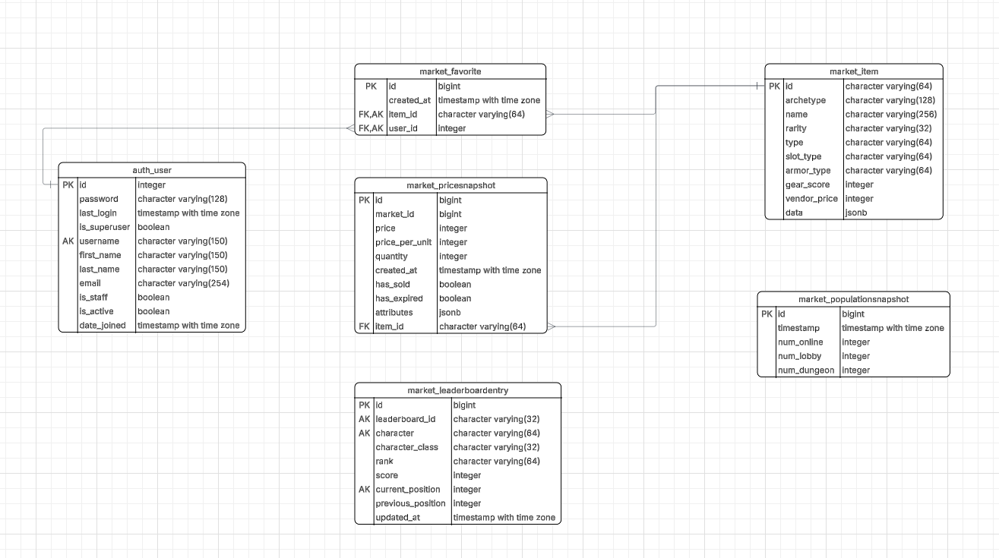

# Курсовая работа

## Тема
Веб-приложение для анализа торговой площадки игры "Dark and Darker"

## Участники
- Иванов Михаил Константинович, гр. 5130904/20102
- Медведев Станислав Андреевич, гр. 5130904/20102
- Эрдоган Батухан, гр. 5130904/20102
- Крючков Сергей Александрович, гр. 5130904/20102

## Этапы

### Определение проблемы

> Игрокам "Dark and Darker" сложно отслеживать и анализировать состояние внутриигрового рынка из-за отсутствия удобных инструментов для агрегации и поиска данных. Пользователи вынуждены тратить много времени на ручной мониторинг цен непосредственно в игре, что увеличивает вероятность упустить выгодное предложение и мешает эффективной торговле.

### Выработка требований
Пользовательские истории UML:


В виде текста:
```
История 1: Поиск и просмотр предметов

    Как игрок,я хочу искать предметы по названию и применять фильтры по редкости и типу, чтобы быстро находить нужные мне товары и сравнивать лучшие предложения по цене.

Критерии приемки (Acceptance Criteria):

    На странице items есть строка поиска.
    
    Рядом со строкой поиска есть выпадающие списки для фильтров "Редкость", "Тип предмета" и "Слот".
    
    После нажатия на кнопку "Найти" отображается список найденных предложений.

    Каждое предложение в списке содержит название предмета и редкость.

    Список отсортирован по возрастанию качества.

    Если ничего не найдено, список будет пустым.

История 2: Анализ рыночных цен

    Как игрок, я хочу видеть график изменения средней цены на конкретный предмет за последнюю неделю, чтобы понимать рыночные тренды и принимать взвешенное решение о покупке или продаже.

Критерии приемки:

    На странице с детальной информацией о предмете есть график истории цен и под ним таблица с последними объявлениями о продаже.

    В этом разделе отображается график.

    Ось X графика — это даты (последние 7 дней).

    Ось Y графика — это средняя цена предмета в этот день.

    При наведении на точку на графике отображается средняя цена.

История 3: Отслеживание избранных предметов

    Как зарегистрированный игрок, я хочу добавлять предметы в личный список "Избранное", чтобы отслеживать цены на самые важные для меня вещи без необходимости искать их каждый раз заново.

Критерии приемки:

    У каждого предмета на странице с детальной информацией есть кнопка "Favorite".

    После нажатия на кнопку появляется уведомление, и предмет добавляется в личный кабинет пользователя.

    В личном кабинете есть раздел "Dashboard", где отображается список всех добавленных предметов.

    Нажатие на кнопку "Unfavourite" удаляет предмет из избранного.

```

### Разработка архитектуры и детальное проектирование
#### Характер нагрузки на сервис
Для оценки нагрузки на сервис было принято за основу оценочную нагрузку в 10000 уникальных пользователей в сутки. Это число является реалистичным для нишевого, но популярного инструмента в сообществе игры "Dark and Darker".

- Пиковая активность: Пользовательская активность неравномерна и имеет ярко выраженные пики, связанные с игровым прайм-таймом (вечерние часы, выходные) и выходом обновлений игры. Мы предполагаем, что 80% суточной нагрузки придется на 8-часовой интервал.

##### Соотношение R/W нагрузки

- Соотношение операций чтения/записи (Read/Write Ratio):

    - Операции чтения (Read): Поиск предметов, просмотр списков, фильтрация, просмотр графиков цен. Это абсолютное большинство всех операций.

    - Операции записи (Write): Добавление/удаление предмета из "Избранного", регистрация пользователя (если будет). Эти операции крайне редки по сравнению с чтением.

- **Оценка**: мы оцениваем соотношение как ~90:10 (чтение/запись).

##### Объемы трафика
- Запросы в секунду (RPS):

    - Средняя сессия пользователя включает несколько поисковых запросов, просмотр списков и просмотр двух-трех графиков. Оценим это в 20 запросов к API на пользователя в день.

    - Общее количество запросов в сутки: 10 000 пользователей * 20 запросов = 200 000 запросов.

    - Пиковая нагрузка: (200 000 * 0.8) / (8 часов * 3600 сек) ≈ 6 RPS.
- **Оценка**: Пиковая нагрузка на API оценивается в 15-20 запросов в секунду (RPS). Основной трафик будет генерироваться запросами к API и отдачей статических ассетов (JS/CSS/изображения) фронтенда.

##### Объемы дисковой системы

- Состав данных: Каждая запись о рыночном предложении будет хранить ID предмета, цену, количество, имя продавца, временную метку. Средний размер одной такой записи ~300 байт.

- Интенсивность поступления данных: Предположим, что наш сервис будет опрашивать API игры и сохранять в среднем 200 000 уникальных/обновленных предложений в сутки.

- Расчет:

    Объем в день: 200 000 записей * 300 байт ≈ 60 МБ.

    Объем в год: 60 МБ * 365 дней ≈ 22 ГБ.

    Объем за 5 лет: 22 ГБ * 5 лет ≈ 110 ГБ.

- **Оценка**: Основной объем данных приходится на историю цен. При периоде хранения в 5 лет и интенсивности ~200 000 записей в сутки, ожидаемый объем базы данных составит ~110 ГБ (без учета индексов и репликации).

#### Диаграммы


Описание:
Система "DarkerDB" находится в центре. С ней взаимодействуют два внешних актора:

- Игрок (Player): Основной пользователь, который через веб-браузер ищет предметы, просматривает статистику и управляет своим списком избранного.

- Внешнее API игры "Dark and Darker": Внешняя система, которая является единственным источником актуальных данных о рыночных предложениях. Наша система периодически опрашивает это API.


Описание:
Наша система состоит из четырех основных контейнеров:

- Frontend: Одностраничное приложение, работающее в браузере пользователя. Отвечает за весь UI и взаимодействие с пользователем.

- Web Server: "Входная точка" системы. Он отдает статические файлы фронтенда и работает как обратный прокси (reverse proxy), перенаправляя все API-запросы на бэкенд.

- Backend API: Сердце приложения. Реализует всю бизнес-логику, обрабатывает API-запросы, взаимодействует с базой данных и периодически забирает данные из внешнего API через фоновую задачу.

- Database: Хранилище всех данных: информация о предметах, история цен, данные пользователей и их списки избранного.

#### Контракты API

- Аутентификация: Система использует JWT (JSON Web Tokens) для аутентификации пользователей. Клиент получает токены через эндпоинт /api/token/ и использует их для доступа к защищенным ресурсам (например, к "Избранному").

- Нефункциональное требование: Среднее время отклика для всех GET-запросов при целевой нагрузке не должно превышать 300 мс.

Ключевые эндпоинты:

1. Поиск и просмотр предметов (User Story 1)

    - Эндпоинт: GET /api/items/

    - Описание: Возвращает список всех предметов.

    - Модель ответа: Массив объектов Item.

2. Просмотр рыночных предложений по предмету

    - Эндпоинт: GET /api/items/{id}/market/

    - Описание: Возвращает актуальные рыночные предложения для конкретного предмета по его ID.

3. Получение истории цен (User Story 2)

    - Эндпоинт: GET /api/items/{item_id}/history/

    - Описание: Возвращает исторические данные о ценах для построения графика.

    

4. Управление избранным (User Story 3)

    - POST /api/favorites/: Добавление предмета в избранное.

    - GET /api/favorites/: Получение списка избранных предметов.

    - DELETE /api/favorites/{id}/: Удаление предмета из избранного.

    - Модель: Favorite, которая связывает пользователя с Item.

#### Схема базы данных


**Обоснование**
- Индексация items: Для эффективного поиска и фильтрации (GET /api/items/) будут созданы индексы для полей: name (с использованием trgm для поиска по подстроке), rarity, type.

- Индексация price_history: Для быстрого построения графиков (GET /api/items/{item_id}/history/) будет создан композитный индекс по (item_id, timestamp). Это критически важно для производительности.

- Индексация favorites: Для быстрого получения избранных товаров конкретного пользователя будет создан индекс по user_id.

#### Схема масштабирования сервиса при росте нагрузки в 10 раз
При 10-кратном росте нагрузки (до ~150-200 RPS) текущая архитектура потребует улучшений. План масштабирования будет состоять из следующих шагов:

- Вертикальное масштабирование (первый шаг): Увеличение ресурсов (CPU/RAM) для сервера, на котором запущен Docker. Это простое и быстрое решение, которое даст запас прочности на начальных этапах роста.

- Горизонтальное масштабирование бэкенда (основной шаг):

    - Наше Django-приложение является stateless (не хранит состояние сессии на сервере). Это позволяет нам запустить несколько экземпляров (контейнеров) backend.

    - Nginx будет настроен как балансировщик нагрузки (load balancer), распределяя запросы между всеми доступными экземплярами бэкенда по алгоритму Round Robin. Это основной способ масштабирования API.

- Масштабирование базы данных:

    - Read Replicas: Учитывая нашу 90:10 R/W нагрузку, самым эффективным решением будет создание одной или нескольких реплик базы данных, работающих в режиме "только для чтения" (read-only).

    - Бэкенд-приложение будет настроено так, чтобы все запросы на чтение (SELECT) отправлялись на реплики, а все запросы на запись (INSERT, UPDATE) — на основной (master) сервер БД. Это кардинально снизит нагрузку на master-сервер.

- Внедрение кэширования и CDN:

    - Кэш: Для самых частых запросов (например, главная страница, самые популярные предметы) можно внедрить слой кэширования на Redis, чтобы отдавать ответы, не обращаясь к Django и БД.

    - CDN: Все статические ассеты фронтенда (JS, CSS, изображения) будут вынесены на CDN. Это ускорит загрузку для пользователей по всему миру и снимет нагрузку с нашего Nginx.

### Сборка

1. Создать `.env` файл в корне проекта
```
POSTGRES_DB=darkerdb
POSTGRES_USER=darker
POSTGRES_PASSWORD=changeme
POSTGRES_PORT=5432

DJANGO_SECRET_KEY=unsafe-secret
DJANGO_DEBUG=True
DJANGO_ALLOWED_HOSTS=*
BACKEND_CORS_ORIGINS=http://localhost:5173,http://127.0.0.1:5173

DARKERDB_API_BASE=https://api.darkerdb.com
DARKERDB_API_KEY=a946526942b378823b1b

FRONTEND_PORT=5173
BACKEND_PORT=8000
```
2. Build and run
```bash
docker compose up -d --build backend frontend
```
3. Открыть:
- Frontend: http://localhost:5173
- API docs: http://localhost:8000/api/docs/

4. Запуск тестов
```bash
docker compose up --build backend_tests
docker compose up -d --build frontend
docker compose exec frontend npm test
```